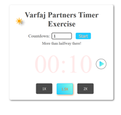

# Quick Countdown Timer App built in ReactJS

### Created on behalf of Varfaj Partners.

Note: App is written w/o bundlers/dev env. React/babel imported from CDN 
Cross-origin requests blocked (HTML loading JS file in same directory)
(use browser's privacy.file_unique_origin option to load directly || inline JS directly in HTML)

App Screenshots:

